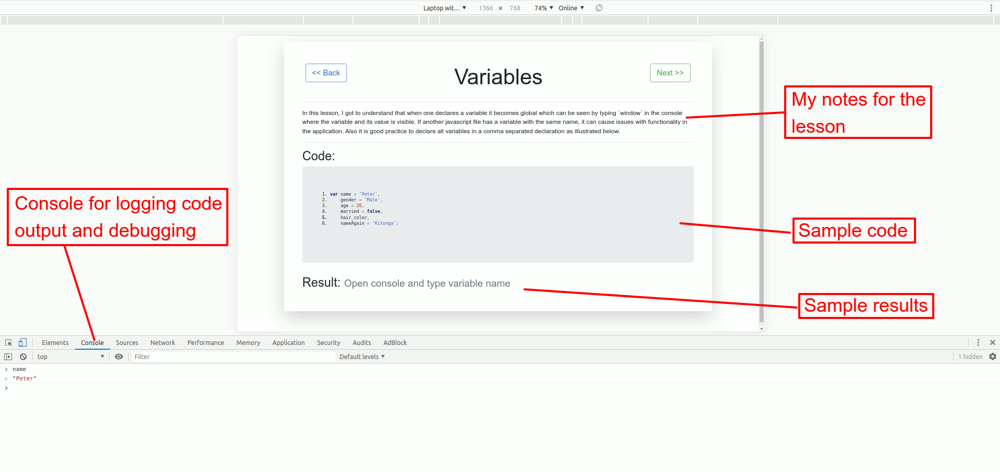

## About

### Brief

This repo demonstrates the lessons I went through while revising vanilla javascript. The purpose of this was to just remind myself of the concepts I have forgotten and hopefully cover the things I missed during my beginner period. 

### Setup

Simply:
- Clone the repo 

```
git clone https://github.com/PeterKitonga/vanillajsrevision.git
```
- Navigate to the project and click on the `index.html` file of a lesson

### Illustration


### Tutorial
Visit [Stone River Learning](https://stoneriverelearning.com) for the tutorial